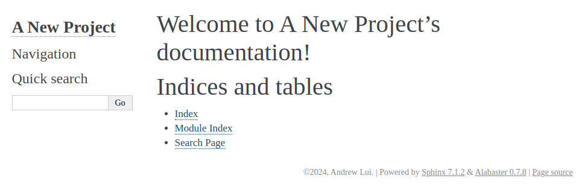
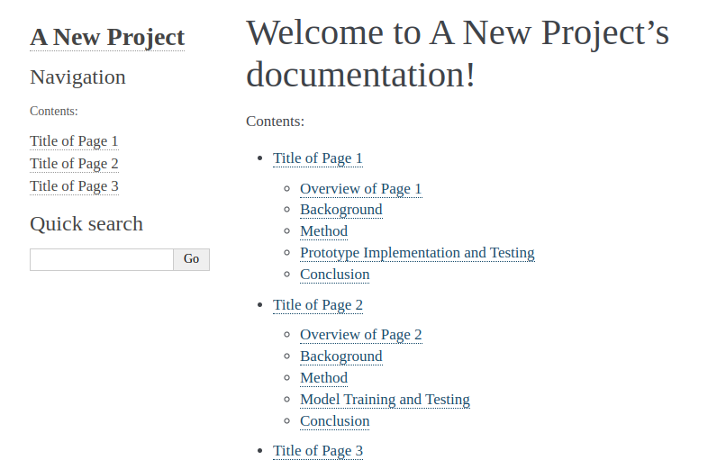
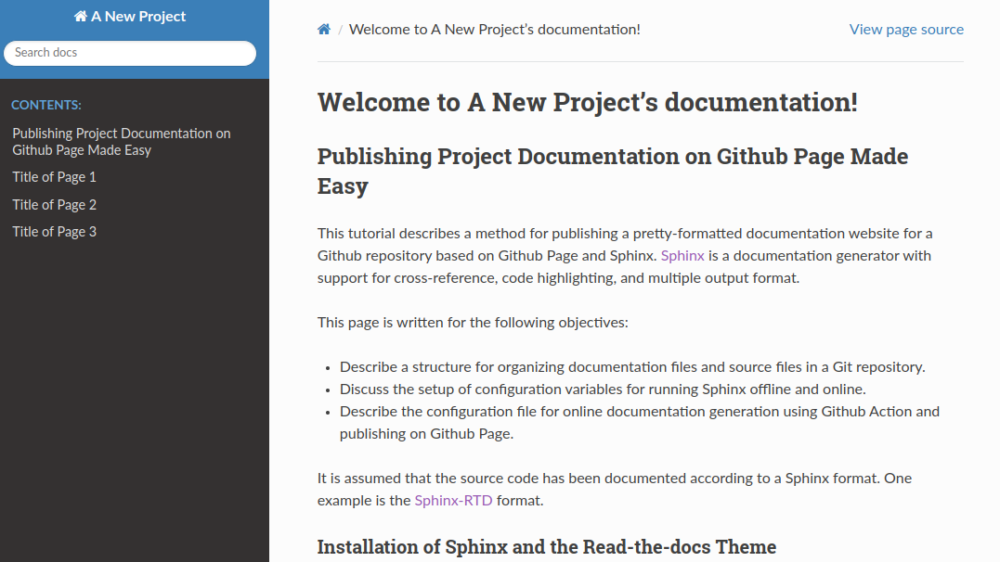
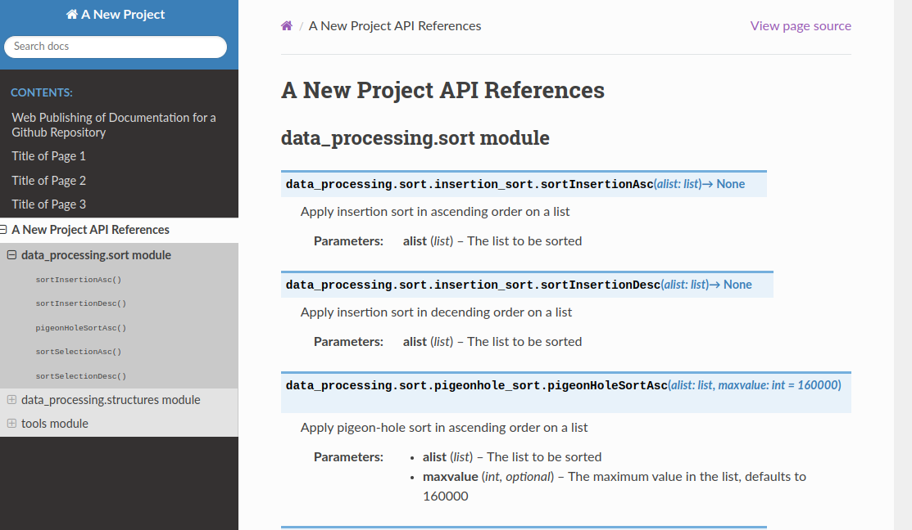
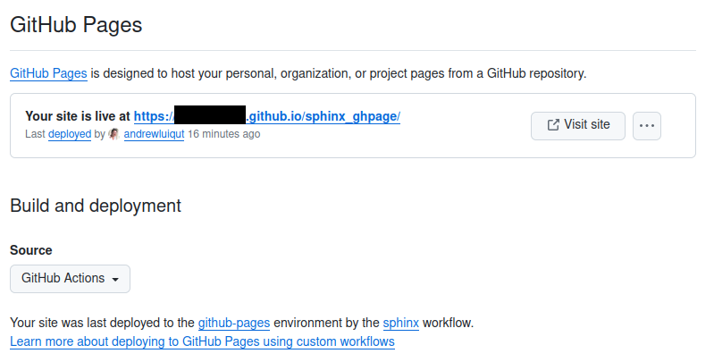

# Web Publishing of Documentation for a Github Repository

**Robotics and Autonomous Systems Group, Research Engineering Facility, Research Infrastructure** 
**Queensland University of Technology**

The tutorial describes a procedure for publishing a documentation website for a Github repository. The website may offer programming references, and the associated textual and multimedia content such as user guide or learning materials. This repository is an example of the setup as well as a template for adaption to other projects.

The website is hosted on Github Pages so that source code management, documentation, and web publishing can be managed on a single platform.

## Introduction

The tutorial is divided into three stages.
- **Stage 1**: Setup a Sphinx project folder which will contain configuration files, source files for textual documentation, and the generated static HTML pages for the website.
- **Stage 2**: Add content to the project folder, configure the project, and test build the project locally.
- **Stage 3**: Setup a Github Action workflow to automate the building of Sphinx project and the uploading of the generated website to Github Pages, triggered by pushing the repository.

### Background

The procedure is based on the following techniques. 

- [Sphinx](https://www.sphinx-doc.org/en/master/index.html) is a documentation generator with support for cross-reference, code highlighting, and multiple output format. For the documentation website, Sphinx is used for rendering web pages.
- [Github Markdown format (.md)](https://docs.github.com/en/get-started/writing-on-github/getting-started-with-writing-and-formatting-on-github/quickstart-for-writing-on-github) is an easy-to-learn and highly readable way to format plain text. It supports content structuring, media embedding and cross referencing. 
- [ReStructuredText format (.rst)](https://www.sphinx-doc.org/en/master/usage/restructuredtext/basics.html) is another popular format for plain text. It enables more sophisicated formatting and more advanced version of cross-referencing and other features.
- [Sphinx docstring format](https://sphinx-rtd-tutorial.readthedocs.io/en/latest/docstrings.html) is a format for program code annotation recognized by Sphinx.
- [Github Pages](https://pages.github.com/) is a web hosting service that can turn the content of a Github repository into a website.
- [Github Actions](https://docs.github.com/en/actions) is a platform for continuous integration and deployment. Custom containerized workflows that automates building, testing, and deployment can be defined. 

While studying the above techniques is no doubt useful, a thorough understanding of these is not needed for going through this tutorial.

### Quick Start by Imitation

A probably easier alternative to reading this tutorial is to adapt a new project based on this repository. 

Download or fork this repository to get started. Explore the folder structure and the file content for understanding of the setup of the documentation website. Adapt the content to the requirements of a new project. At the end, setup a new repository on Github for hosting the project.
Jump to Stage 3 of this tutorial for information on how to configure Github Pages through a web interface. 

If this is the preferred way to start, bye for now.

## Stage 1: Setup a Sphinx project folder 

This is the proper beginning of the tutorial. In Stage 1, the objective is to convert a local git repository into one ready for the setup and rendering of a documentation website. It is assumed that the repository contains source program files, which may be distributed across several directories.

### Installation of Sphinx

This step installs Sphinx on the local computer for offline generation of the website. The ability helps clear out any error such as missing links and asset in the markup content in source files. Ultimately the website generation will be handled by Github Actions as part of the automation workflow. 

Here is the installation scripts for Ubuntu and similar Linux platforms.
```
sudo apt-get install python3-sphinx -y

sudo pip install sphinx_rtd_theme myst_parser docutils==0.20
```
The first line installs Sphinx. The second line installs a presentation theme for Sphinx and a parser for conversion of Github markdown files (e.g. README.md). Sphinx supports different [presentation themes](https://sphinx-themes.org/). This tutorial will use `sphinx_rtd_theme`. 

### Initialize Sphinx Project Folder

The next step is to create a Sphinx project folder in the repository, and populate it with skeleton files. This can be done easily with the Sphinx command `sphinx-quickstart`. The recommended location for the project folder is `/docs` under the root of the repository. 

First, change directory to the root of the local git repository. Then execute the following
```shell 
$ mkdir docs & cd docs
$ sphinx-quickstart 
```
The command will start an interactive session and a few question will be asked.
```
Welcome to the Sphinx 7.1.2 quickstart utility.

Please enter values for the following settings (just press Enter to
accept a default value, if one is given in brackets).

Selected root path: .

You have two options for placing the build directory for Sphinx output.
Either, you use a directory "_build" within the root path, or you separate
"source" and "build" directories within the root path.
> Separate source and build directories (y/n) [n]: y

The project name will occur in several places in the built documentation.
> Project name: A New Project
> Author name(s): Andrew Lui
> Project release []: 1.0

If the documents are to be written in a language other than English,
you can select a language here by its language code. Sphinx will then
translate text that it generates into that language.

For a list of supported codes, see
https://www.sphinx-doc.org/en/master/usage/configuration.html#confval-language.
> Project language [en]: 

Creating file /home/qcr/arm_commander_ws/src/sphinx_ghpage/source/conf.py.
Creating file /home/qcr/arm_commander_ws/src/sphinx_ghpage/source/index.rst.
Creating file /home/qcr/arm_commander_ws/src/sphinx_ghpage/Makefile.
Creating file /home/qcr/arm_commander_ws/src/sphinx_ghpage/make.bat.

Finished: An initial directory structure has been created.

You should now populate your master file /home/qcr/arm_commander_ws/src/sphinx_ghpage/source/index.rst and create other documentation
source files. Use the Makefile to build the docs, like so:
   make builder
where "builder" is one of the supported builders, e.g. html, latex or linkcheck.
```
Things to note:
- Separating source and build directory seems resulting in a more organized structure.
- The project name, author name and release will be saved in the configuration file and will be displayed at different places in the documentation. They can be updated later in the configuration file. 

The resulting folder structure under the repository root should look like the following.

```bash
root
├── docs
├── src             # existing source folder
├── other_src       # existing source folder
├── more_src        # existing source folder
```

```bash
├── docs
├── ├── source          # holding the source markdown files and other assets 
├── ├── ├── _static     # where custom javascript, css, and other asset files (e.g. images) are stored 
├── ├── ├── _templates  # where custom javascript, css, and other asset files (e.g. images) are stored 
├── ├── ├── conf.py     # the Sphinx configuration file
├── ├── ├── index.rst   # the top-level documentation file for the landing page
├── ├── build           # the output files
├── ├── ├── html        # the output web pages 
├── ├── ├── doctrees    # internal indices
```
### Test Build the Project

The file `index.rst` specifies the content for the default landing page. It already contains a skeleton structure and content. Let's try building the project for a one-page website.

Change directory into the `docs` folder and execute the following.
```bash
make html
```
The build process will finish quickly. The files of the generated website can be found under `/docs/build/html`. At completion, point a web browser to the file at `/docs/build/html/index/html` or double click on the file on a GUI. Open the file `index.rst` and make a mental note on the relation of its content to the rendered html file.




## Stage 2: Add Content to the Documentation Website

In Stage 2, the objective is to put together the content of the documentation website so that the git repository is ready for Github Actions and Github Pages.

This stage is divided into two steps. The first step is to get the textual and multimedia content (the non-program source files) ready. The second step is to integrate the programming interface references into the website.

### Overview of the Landing Page 

The master file in Sphinx is `index.rst` under the `source` folder. It specifies the default landing page for the documentation website. The suffix `.rst` indicates the use of the [reStructuredText format](https://www.sphinx-doc.org/en/master/usage/restructuredtext/basics.html). This is the default format used in Sphinx.

```
.. A New Project documentation master file, created by
   sphinx-quickstart on Tue Apr  9 09:49:28 2024.
   You can adapt this file completely to your liking, but it should at least
   contain the root `toctree` directive.

Welcome to A New Project's documentation!
=========================================

.. toctree::
   :maxdepth: 2
   :caption: Contents:

Indices and tables
==================

* :ref:`genindex`
* :ref:`modindex`
* :ref:`search`
```
Important things to note include:
- The minimum master file must contain at least the table of content, which is the section marked by `.. toctree::`. 
- The headings are the lines decorated by having a list of equal signs `====` in the following line, with the number of equal signs greater or equal to the lenght of the headings.
- The following lines represent auto-generated indices and links. 
```
* :ref:`genindex`
* :ref:`modindex`
* :ref:`search`
```  

### Adding More Markdown Files to the Project

Consider that the documentation comprise the following five files `api_references.rst`, `README.md`, `PAGE_1.md`, `PAGE_2.md`, and `PAGE_3,md`. The first is a reStructuredText file and the rest are Github markdown files. As in the case of conventional static website development, hyperlinks are to be setup between the landing page and these files.

#### Updating the Table of Content

One way to setup the hyperlink is to update the table of content in `index.rst`. Insert the following under the `.. toctree::` element.

```
.. toctree::
   :maxdepth: 2
   :caption: Contents:
   README
   PAGE_1
   PAGE_2
   PAGE_3
   api_references
```
Note that the file suffix can be omiited.

#### Using In-Text Links

Alternatively, in-text links can be added to the markdown files.  The following shows how to add a relative link in Github Markdown files. Links are to be setup from `README.md` to each of the `PAGE_1.md`, `PAGE_2.md` and `PAGE_3.md`, which are all located in the `/docs/source` directory .

```
- [Page 1](./PAGE_1.md)
- [Page 2](./PAGE_2.md)
- [Page 3](./PAGE_3.md)
```
Here are the generated links to the three documents.
- [Page 1](./PAGE_1.md)
- [Page 2](./PAGE_2.md)
- [Page 3](./PAGE_3.md)

The following shows an example of adding relative links in `.rst` files. The anchor text will be obtained from the header of the target document.
```
:doc:`path/to/document`
```

#### Configuring the Project to Enable the Github Markdown Format

The hyperlinks will be setup and validated by Sphinx during the build process. All referenced files are expected to be stored under the `/docs/source`. The build process will also output warnings of dangling files that are not linked to the landing page. 

Recall that reStructuredText is the default format in Sphinx projects. To handle other formats such as Github Markdown, adding plugins is required. Open the file `/docs/source/conf.py` and look for the definition of the variable `extensions`. Add `myst_parser` to the list. 
```
extensions = ['myst_parser']
```
The `myst_parser` component, which should have been installed, can parse Github Markdown format. The above configures the Sphinx so that the installed parser will be used in the build process. 

Add the following to specify the suffices of `.rst` and `.md` as acceptable.
```
# The suffix(es) of source filenames.
# You can specify multiple suffix as a list of string:

source_suffix = ['.rst', '.md']
```
#### Re-Building the Project for Testing

Sphinx is now able to handle the markdown files. Execute `make html` to re-build the project and reload the landing page to see the results.



#### Placing Image Files and Other Multimedia Assets

The recommended location for image files and other multimedia assets is the `/docs/source/_static` folder. In this repository, a number of images can be found under `/docs/source/_static/assets`. Sphinx will include these files in the `/docs/build/html` folder in the build process.

The path to the static assets can be modified by setting the variable `html_static_path` to another value in `conf.py`.
```
html_static_path = ['_static']
```

#### Including Content from Another File

The landing page may look a bit light in content. The content of this README file is a good candidate for use in a landing page. The following shows the modified `index.rst` which has included the README file in the body panel of the landing page. The other parts of the file has stayed the same. 

```
Welcome to A New Project's documentation!
=========================================

.. include:: README.md
   :parser: myst_parser.sphinx_
```
Things to note include:
- Add the `.. include::` element just below the main title.
- The specification of `:parser::` enables Sphinx to parse the source file properly.

Re-build the project and view the result.  The content of this file should be found in the body panel. 

### Changing the Theme of Look-and-Feel

The look-and-feel of the website can be easily determined by changing the theme. Open `conf.py` and add the following variable, which sets the theme to `sphinx-rtd-theme`. The theme `sphinx_rtd_theme` is one used in the popular online documentation host platform Read-the-Docs. 
```
html_theme = 'sphinx_rtd_theme'
```
The resulting look-and-feel is shown below.



Refer to the [Sphinx Theme Gallery](https://sphinx-themes.org/) for more themes. To use another theme, in addition to changing the variable `html_theme` in the `conf.py` file, installation is required as in the case of `sphinx_rtd_theme`. 

### Integration of Programming References and the Documentation Website

The file `api_references.rst` is a placeholder for linking to source code documentation.

The `autodoc` component of Sphinx can process the docstrings in the source code and supports auto-generation of cross-references and indices. This tutorial assumes that the source code has already been documented with a suitable docstring format. For instructions and references, please refer to the following resources:
- The [Sphinx docstring format](https://sphinx-rtd-tutorial.readthedocs.io/en/latest/docstrings.html)
- The [Sphinx autodoc extension](https://www.sphinx-doc.org/en/master/usage/extensions/autodoc.html)

#### Configuring the Project to Enable AutoDoc

##### 1. Enable the autodoc extension

Add the string `'sphinx.ext.autodoc'` to the list variable `extensions` in the `conf.py` file. This will enable the `autodoc` component in Sphinx.
```
extensions = [
    'sphinx.ext.autodoc',   
    'myst_parser',
]
```

##### 2. Inform Sphinx the path(s) to the source code 

Inform Sphinx the path(s) to the source code by add the following to the beginning part of `conf.py`.
```
sys.path.insert(0, os.path.join(os.path.dirname(__file__), '../src'))
```
If the documented source code are found in files stored in multiple paths, for each path add a `insert` statement. For examples, if the source code files are distributed across the following repository structure.
```bash
root
├── docs
├── ├── source          # holding the source markdown files and other assets 
├── ├── ├── _static     # where custom javascript, css, and other asset files (e.g. images) are stored 
├── ├── ├── _templates  # where custom javascript, css, and other asset files (e.g. images) are stored 
├── ├── ├── conf.py     # the Sphinx configuration file
├── ├── ├── index.rst   # the top-level documentation file for the landing page
├── src                 # source folder
├── ├── data_processing
├── ├── ├── __init__.py
├── ├── ├── sort
├── ├── ├── ├── __init__.py
├── ├── ├── ├── insertion_sort.py
├── ├── ├── ├── pigeonhold_sort.py
├── ├── ├── ├── selection_sort.py
├── ├── ├── structures
├── ├── ├── ├── __init__.py
├── ├── ├── ├── binary_tree_adt.py
├── ├── ├── ├── linked_list_adt.py
├── ext                 # another source folder
├── ├── tools
├── ├── ├── __init__.py
├── ├── ├── opencv_tools.py
```
The following statements will enable Sphinx to locate the two source folders
```
sys.path.insert(0, os.path.join(os.path.dirname(__file__), '../src'))
sys.path.insert(0, os.path.join(os.path.dirname(__file__), '../ext'))
```

##### 3. Specify the source modules to be included in the programming references

As the placeholder file `api_references.rst` is already linked to the landing page, the work to do is to add the modules, classes, functions, etc that are to be included in the API references page.

For example, the following list contains the Python program files (i.e. modules) to be included. Note that these files are in the paths specified above.

```python
data_processing.sort.insertion_sort.py
data_processing.sort.pigeonhole_sort.py
data_processing.sort.selection_sort.py
data_processing.structures.binary_tree_adt.py
data_processing.structures.linked_list_adt.py
data_processing.structures.queue.py
data_processing.structures.stack.py
tools.opencv_tools.py
```
To include all the modules are included in the same page `api_references.rst`, add the following to the file.
```
data\_processing.sort module
---------------------------------------

.. automodule:: data_processing.sort.insertion_sort
    :members:
    :show-inheritance:

.. automodule:: data_processing.sort.pigeonhole_sort
    :members:
    :show-inheritance:

.. automodule:: data_processing.sort.selection_sort
    :members:
    :show-inheritance:    

data\_processing.structures module
-----------------------------------

.. automodule:: data_processing.structures.binary_tree_adt
    :members:
    :undoc-members:
    :show-inheritance:

.. automodule:: data_processing.structures.linked_list_adt
    :members:
    :undoc-members:
    :show-inheritance:

.. automodule:: data_processing.structures.queue
    :members:
    :undoc-members:
    :show-inheritance:

.. automodule:: data_processing.structures.stack
    :members:
    :undoc-members:
    :show-inheritance:

tools module
----------------------------

.. automodule:: tools.opencv_tools
    :members:
    :undoc-members:
    :show-inheritance:
```

##### 4. Telling Sphinx autodoc to ignore third party modules

Sphinx autodoc attempts to generate cross-references for the modules. However, the source of third party modules such as `numpy` and `cv2` is not available. Sphinx must be configured to ignore these third party modules.

Open `conf.py` and add the list of to-be-ignored modules to the list variable `autodoc_mock_imports`.
```
autodoc_mock_imports = ['cv2', 'numpy', 'matplotlib']
```

#### ReBuilding the Project

Re-build the project and observe the results.




## Stage 3: Setup Github Page Publishing

There remains the samll matter of publishing the documentation website on Github Page. In Stage 2, the objective is to get this done. The method to be used here is based on a workflow file as a specification for Github Actions.

### The Workflow File

The following workflow file instruct Github Action to run several jobs, which include building the Sphinx project in a container and to instruct Github Page to publish the generated documentation website.  
```yaml
name: sphinx
on: [push, pull_request, workflow_dispatch]

permissions:
  contents: write
  pages: write
  id-token: write

jobs:
  docs:
    environment:
      name: github-pages
      url: ${{ steps.deployment.outputs.page_url }}
    runs-on: ubuntu-latest
    steps:
      - uses: actions/checkout@v3
      - uses: actions/setup-python@v3
      - name: Install dependencies
        run: |
          pip install sphinx sphinx_rtd_theme myst_parser docutils==0.20
      - name: Sphinx build
        run: |
          cd docs && sphinx-build source build/html
      - name: Upload artifact
        uses: actions/upload-pages-artifact@v3
        with:
          path: docs/build/html
      - name: Deploy to GitHub Pages
        id: deployment
        uses: actions/deploy-pages@v4
```

This file is adapted from a [starter-workflow template static.yml](https://github.com/actions/starter-workflows/blob/main/pages/static.yml) provided by Github Action Tutorial. 

The more significant parts are found under `steps:`.
1. Installation of Sphinx, the RTD template, and the markdown parser.
```yaml
      - name: Install dependencies
        run: |
          pip install sphinx sphinx_rtd_theme myst_parser docutils==0.20
```
2. Building the Sphinx project.
```yaml
      - name: Sphinx build
        run: |
          cd docs && sphinx-build source build/html
```
3. Uploading the generated documentation website to Github Page. Note the specification of the path to the website, which is `docs/build/html` and by default the file `index.html`.
```yaml
      - name: Upload artifact
        uses: actions/upload-pages-artifact@v3
        with:
          path: docs/build/html
```

### Adding the Workflow File to the Repository for Deployment

There are two methods to give Github Actions the workflow file.

#### Method 1: Including the file in the /.github/workflow folder in the repository

Check out the folder in this repository that contains the file `sphinx.yml`. The content of the file is the same as the one in the previous section. Note that the filename is irrelevant. The file will be copied to the list of workflow file under Actions of the repository during a push.

#### Method 2: Including the file in the /.github/workflow folder in the repository

Create a workflow file under the `Actions` tab on the menu bar of the repository webpage. This is the also the place where editing the workflow file is supported.

### The Final Step

The final step is actually automatic. The workflow is triggered automatically when the repository is pushed to Github. It can also be triggered manually through the `Actions` tab.

The workflow may take 20 to 30 seconds to run and the progress can be monitored using the `Actions` tab again. If everything goes smooth, the `Pages` interface under `Settings` will display the URL for the deployed website.



Thank you for reading this tutorial and hope you have found it useful.


## References

- [Sphinx Autodoc](https://www.sphinx-doc.org/en/master/usage/extensions/autodoc.html#module-sphinx.ext.autodoc): include documentation from docstrings.
- [Sphinx Theme Gallery](https://sphinx-themes.org/)
- [Learn Github Actions](https://docs.github.com/en/actions/learn-github-actions)
- [Getting Started with Github Pages](https://docs.github.com/en/pages/getting-started-with-github-pages)

### Author

Dr Andrew Lui, Senior Research Engineer <br />
Robotics and Autonomous Systems, Research Engineering Facility <br />
Research Infrastructure <br />
Queensland University of Technology <br />

Latest update: April 2024
